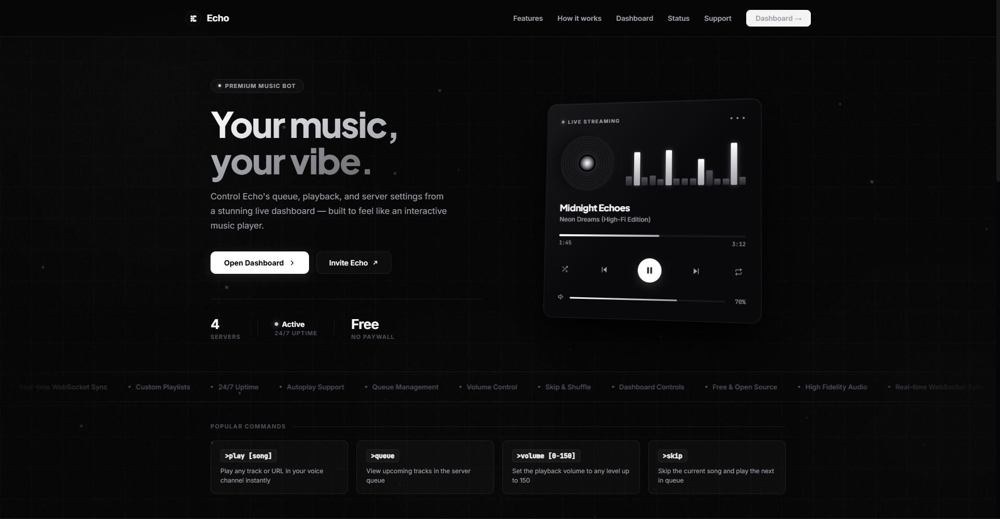
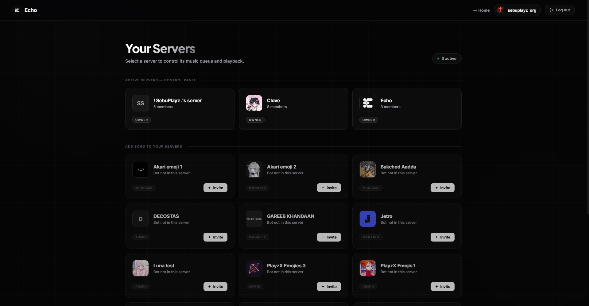
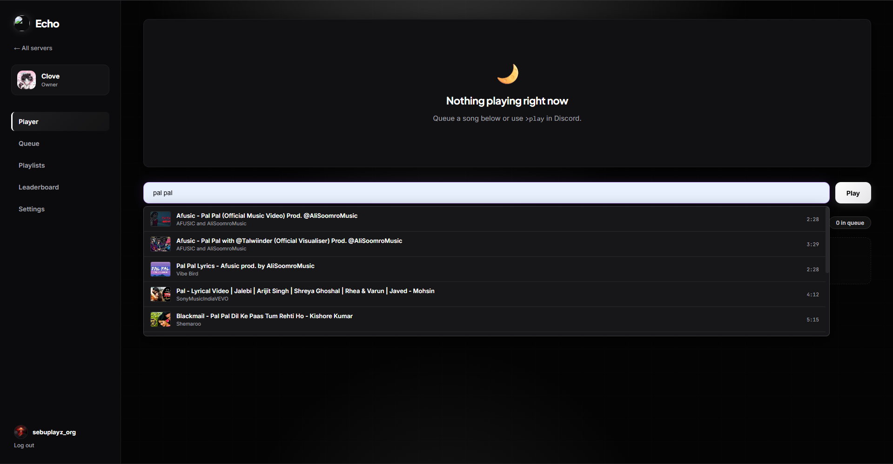
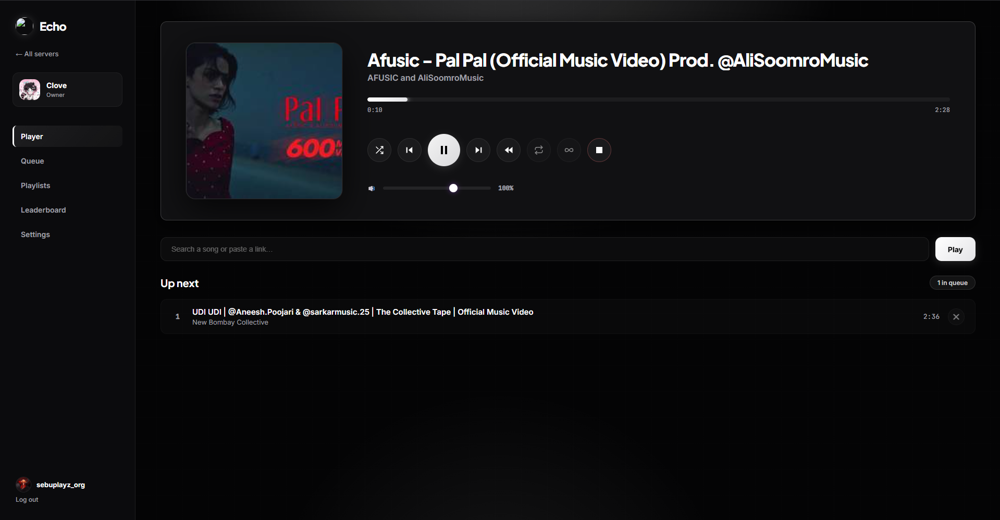
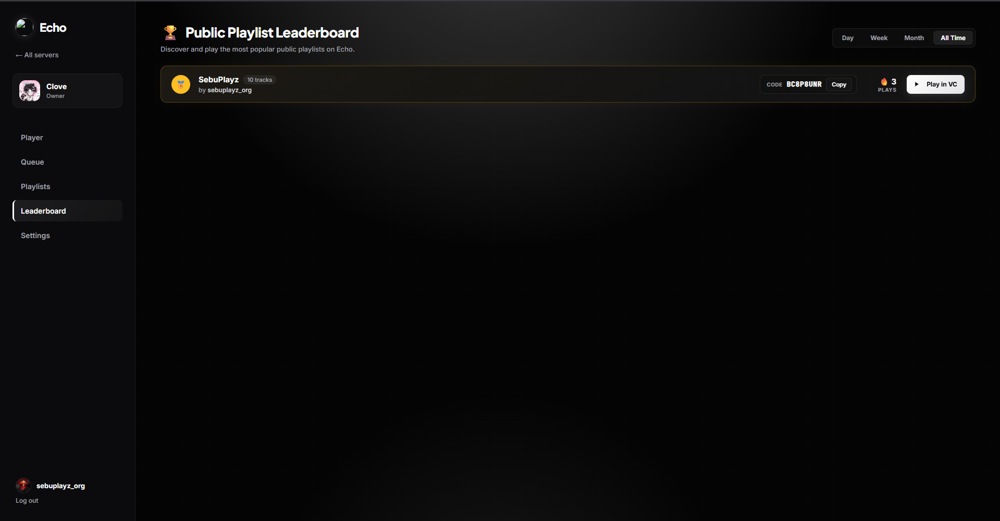
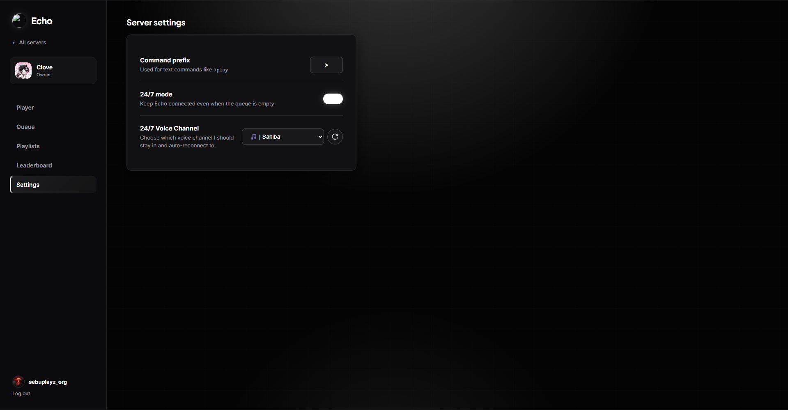

# 🎵 Echo Music Bot + Web Dashboard

> A powerful Discord Music Bot with a modern Web Dashboard for complete music management, playlist sharing, and server control.


---

# ❤️ Credits

## Original Project by **R3novadcl**

This project is based on the original Discord Music Bot created by **R3novadcl**.

I did **not** create this bot from scratch.

I have customized and improved the project by:

- ✨ Redesigning the Dashboard
- 🎵 Adding Playlist Management
- 🔗 Playlist Share System
- 📊 Dashboard Statistics
- 🐞 Bug Fixes
- ⚡ Performance Improvements
- 🎨 UI Improvements
- 🛠️ Various Enhancements

**Full credit for the original source code belongs to R3novadcl.**

Thank you for creating this amazing project ❤️

---

# 🌟 Repository

### GitHub Repository

https://github.com/SebuPlayz/Echo-Music-Bot-Dashboard

---

# ✨ Features

## 🎵 Music Features

- High Quality Audio Playback
- Slash Commands
- Spotify Support
- SoundCloud Support
- Queue System
- Autoplay
- Loop
- Shuffle
- Pause / Resume
- Skip
- Volume Control
- Playlist Support
- 24/7 Music Mode
- Fast & Stable Playback

---

## 🌐 Dashboard Features

The Echo Dashboard allows users to control almost everything directly from the browser without using Discord commands.

### 🏠 Modern Dashboard

- Beautiful Home Page
- Dashboard Statistics
- Discord OAuth2 Login
- Mobile Friendly
- Responsive Design
- Fast User Interface

---

### 🎵 Playlist Manager

Manage playlists directly from the Dashboard.

Features include:

- ✅ Create Unlimited Playlists
- ✏️ Edit Playlists
- ❌ Delete Playlists
- 📝 Rename Playlists
- ➕ Add Songs
- ➖ Remove Songs
- 🔍 Search Songs
- 📂 View Playlist Details

---

### 🔒 Playlist Privacy

Each playlist can be configured as:

- 🌍 Public Playlist
- 🔒 Private Playlist

Private playlists are only visible to their owner.

Public playlists can be discovered by everyone.

---

### 🔗 Playlist Sharing

One of the best features of Echo Music Dashboard.

Every playlist automatically generates a unique **Playlist Share Code**.

Simply share the code with friends.

They can instantly import the playlist into their own account without manually adding every song.

---

### 🏆 Playlist Leaderboard

Discover the most popular playlists created by the community.

Features:

- 🏆 Top Ranked Playlists
- 📈 Trending Playlists
- 🌍 Public Playlist Discovery
- ❤️ Community Favorites
- 👥 Most Used Playlists

---

### 📊 Dashboard Statistics

View useful information directly from the Dashboard.

- Total Servers
- Total Users
- Songs Played
- Total Playlists
- Public Playlists
- Private Playlists
- Top Ranked Playlists
- Dashboard Activity

---

# 📸 Dashboard Preview

## 🏠 Landing Page

The welcome page introducing Echo Music Bot with a clean and modern interface.



---

## 🌐 Dashboard Home

Manage all your Discord servers from one place.

Invite Echo Music Bot, access your servers and control everything with one click.



---

## 🔍 Song Search

Search millions of songs directly from the Dashboard.

Add songs instantly without using Discord commands.



---

## 🎵 Song Queue

Control the current music queue directly from the Dashboard.

Features:

- ▶ Play
- ⏸ Pause
- ⏭ Skip
- 🔀 Shuffle
- 🔁 Loop
- ❌ Remove Songs



---

## 🏆 Playlist Leaderboard

Browse the best playlists created by the community.

Discover trending playlists and popular creators.



---

## ⚙️ Settings

Customize your Echo Music Bot experience.

Available settings include:

- Default Volume
- Music Settings
- Dashboard Preferences
- Theme Settings
- Language
- Bot Configuration



---

# ⚙️ Installation

## Clone Repository

```bash
git clone https://github.com/SebuPlayz/Echo-Music-Bot-Dashboard.git
cd Echo-Music-Bot-Dashboard
```

---

## Install Dependencies

```bash
pip install -r requirements.txt
```

---

# 🔧 Configuration

## Edit `.env`

Replace

```env
BOT_TOKEN=YOUR_BOT_TOKEN
```

Then configure:

```env
DISCORD_CLIENT_ID=
DISCORD_CLIENT_SECRET=
DASHBOARD_REDIRECT_URI=
DASHBOARD_SESSION_SECRET=
DASHBOARD_PORT=2076
DASHBOARD_ENABLED=true
```

---

## Edit `config.py`

Replace

```python
OWNER_ID = YOUR_DISCORD_ID
```

with your Discord User ID.

---

# 🌐 Discord OAuth2 Setup

Go to

https://discord.com/developers/applications

Select your application.

Navigate to

```
OAuth2
```

Copy:

- Client ID
- Client Secret

Paste them into your `.env`.

---

# 🔗 Redirect URI

Add the same Redirect URI inside the Discord Developer Portal.

Example:

```
http://localhost:2076/auth/callback
```

or

```
https://yourdomain.com/auth/callback
```

The Redirect URI inside the Developer Portal and your `.env` file **must match exactly**.

Otherwise Dashboard Login will not work.

---

# 📁 Files You Must Edit

Before running the bot edit:

```
.env
config.py
```

---

# 🚀 Run Bot

```bash
python main.py
```

or

```bash
python bot.py
```

depending on your project.

---

# ⭐ Support

If you like this project please consider

⭐ Star this Repository

🍴 Fork this Repository

❤️ Share with your Friends

---

# 📜 License

Please respect the original developer.

If you modify or redistribute this project, kindly keep the original credits to **R3novadcl**.

---

# 👨‍💻 Customized & Maintained by Echo Music

GitHub

https://github.com/SebuPlayz/Echo-Music-Bot-Dashboard

Made with ❤️ by **Echo Music**
